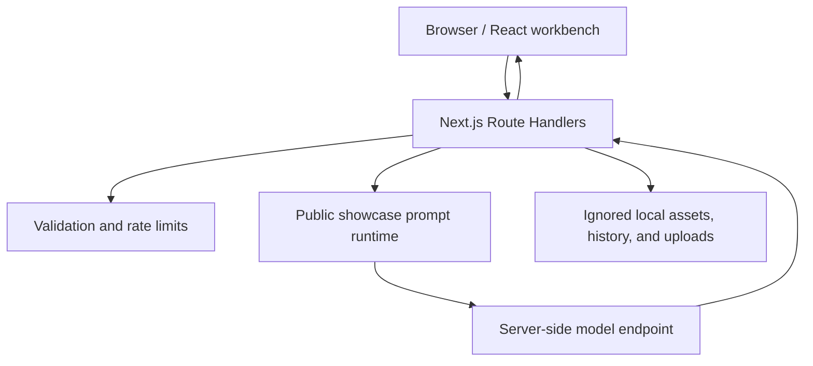

# Architecture

The AI Director Workstation showcase uses the Next.js App Router to separate browser interactions, server-side model connections, and local showcase data.

## Browser boundary

- Renders the Director and Screenwriting workspaces.
- Handles version switching, copying, editing, generation cancellation, and streaming state.
- Can save custom API configuration explicitly entered by the user in the current browser.
- Never receives the default hosted API key in the browser bundle.

## Server boundary

- Resolves default model configuration from environment variables.
- Validates requests, file types, and URLs.
- Combines public showcase structures, user-uploaded content, and user-saved assets.
- Returns video- and image-prompt generation progress through SSE.
- Stores showcase history, assets, and temporary reference files in local development.

## Private-product boundary

The complete product's private knowledge bases, internal sources, research reports, evaluation data, and production persistence configuration are outside this repository. The public edition does not connect to, download, or dynamically request any of that material.
